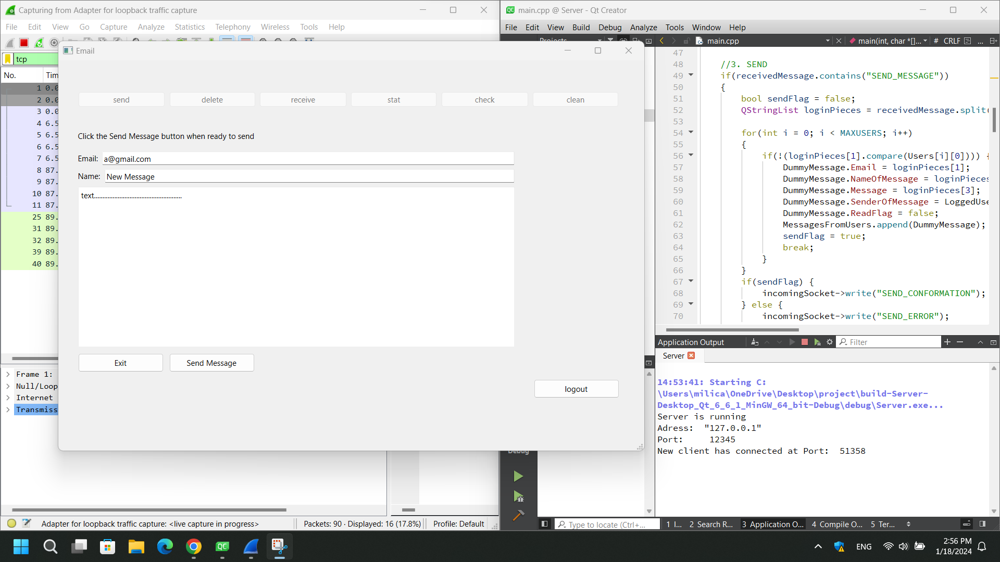

**DEDICATED ELECTRONIC MAIL SYSTEM IN QT**

Project is to make dedicated electronic mail system in QT. It consists of two sides, one is the server, and the other one is client.
Server is a QT Console Application that waits for a client to connect, interacts with it and stores his information.
Client is a QT Widgets Application, with a UI, that is used to interact with the server.
Protocol is described with MSC (Message Sequence Chart) and SDL (Specification and Description Languge) diagrams.
The main communication protocol is TCP, and libraries that are the main focus are QTcpServer and QTcpSocket.

